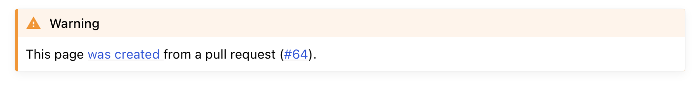

# Developer guide

## Contributing
Check out this [simple guide for using git](https://rogerdudler.github.io/git-guide/).

1. Create a new branch for your contributions.
2. Commit your changes in this branch.
3. [Open a pull request](https://github.com/jemissik/movebank_vis/pulls) to merge changes from your branch into the
repository's ``develop`` branch.

## Documentation

Documentation for this project is created using Sphinx and is hosted at Read the Docs (https://ecodata-animate.readthedocs.io/). The source files
for these pages are located in the [docs folder](https://github.com/jemissik/movebank_vis/tree/develop/docs) of the repository. To edit the documentation, edit the markdown files in this folder (or sub-folders). Note that the ``docs/index.md`` file specifies the contents for the docs site. If a sub-folder has a ``index.md`` file, that file specifies the contents for that section of the docs site (e.g. ``docs/user_guide/index.md``). If files are added or removed, the corresponsing index files will also need to be updated.

### Building the docs
After editing the pages, you can look at a build of the pages to see how things will actually look in the docs website. There are two options for this:
- Option 1: [Open a pull request](https://github.com/jemissik/movebank_vis/pulls), and Read the Docs will build a preview of the docs pages. A link to the build can be found near the bottom of the page of the PR, in the merge checks section. You may have to click "Show details" next to where it says "All checks have passed".  Once the build is finished, click on "Details" for the docs/readthedocs.org:ecodata-animate item:
  

  This will take you to the build for the PR. Once the build is finished, click on the "View docs" link to the right of build info:

  

  Note that the large green "View docs" button at the top of the page takes you to the current docs page, not the PR build. When viewing the docs build for a PR, you should see a banner at the top of the docs pages that looks like this:
  

  You can push additional commits to the open PR if you want to change anything after seeing the preview build. Read the docs will build a new preview whenever a new commit is made to the PR.
  
- Option 2: Build the docs locally. You will need to have python and the docs requirements installed.

    - To install the doc requirements: ``pip install sphinx furo sphinxcontrib-matlabdomain myst-parser`` or install
    using the conda or pip requirements file (located in the ``docs`` directory)
    - Build the docs: ``sphinx-build -b html docs docs/_build``
    - To view the build, open the ``index.html`` in the docs/_build directory that was created.

### Versions of the docs
- Read the Docs builds multiple versions of the documentation (for different branches of the repository). In the bottom corner of the docs pages, there is a box indicating which version you are viewing. You can click on that box to pick a different version.

## Setup instructions for the MATLAB code

### Adding datasets
- Most of the datasets are too large to be stored in the repository
- Datasets used in the example scripts can be downloaded [here](https://drive.google.com/drive/folders/1pyK4E-z8XUjRlYKYFX5L198YOlvOoUHA?usp=sharing)
- Copy any datasets you want to use to ``data/user_datasets``
### Adding topo data for the m_map package
- [Download the topo data](https://drive.google.com/drive/folders/1RmhHbSsm15i5xQVMWLaerv39fHja2fgr?usp=sharing)
- Copy the contents of this folder to ``m_map/data``

### Required toolboxes
The mapping toolbox and the MATLAB Compiler need to be installed.
### Specifying Movebank login credentials:
- Save ``movebank_credentials_template.txt`` as ``movebank_credentials.txt`` and update it with your username and password.
- ``movebank_credentials.txt`` is in the .gitignore so it won't be tracked.

## Compiling the app

This process needs to be done on both Mac and Windows, to build installers for both systems.

- Make sure the topo dataset has been downloaded and added to the m_map folder! (see above)
- Open ``apps/animator.mlapp``
- Edit "Sharing Details" (this can be found if "animator" is selected in the component browser):
  - Update the version (major.minor)
  - Update the description with the release tag
- In the top menu, click ``Share``, then ``Standalone Desktop App``
- In the compiler window:
  - In the top menu, select ``Runtime downloaded from web``, then change the name in the textbox to ``ECODATA_Animate_Installer``
  - In the version box, edit the version (which was auto-filled with major.minor from the .mlapp file). This needs to be updated to major.minor.bugfix.release_candidate (making sure this corresponds to the release tag on GitHub)
  - Under ``Files required for your application to run``, make sure the ``functions`` and ``m_map`` folders are both added!
  - Under ``Additional runtime settings``, select the ``create log file`` box, and change the name to ``ecodata_animate_log``
  - Click the ``Package``button in the top menu.
  - Make a new folder called ``Mac_Installer`` or ``Windows_Installer``.
  - From the output folder created by the compiler, copy the files ``for_redistribution/ECODATA_Animate_Installer`` and ``for_redistribution_files_only/ECODATA_Animate`` to the new folder.
  - Compress the folder to a .zip. The two .zip folders (for Mac and Windows) are what need to be uploaded as release assets.
