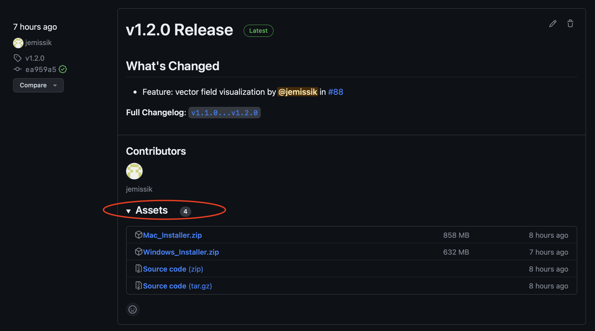
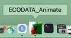

# User guide

ECODATA-Animate is a MATLAB® program for creating customized animated maps of animal movements. The program creates image frames that can be animated using the [ECODATA-Prepare Movie Maker App](https://ecodata-apps.readthedocs.io/en/latest/user_guide/movie_maker.html).

```{Tip}
This user guide can also be downloaded for offline use! [Click here](https://readthedocs.org/projects/ecodata-animate/downloads/) to download the documentation in PDF, Epub, or zipped HTML format.
```

## Installation

1. [Download the installers for the latest release here](https://github.com/jemissik/movebank_vis/releases/latest), available for Mac and Windows. You can also see all releases (including pre-release versions) [here](https://github.com/jemissik/movebank_vis/releases).

    ```{Tip}
    The installer files for download are under the **Assets** section for a release. If you are on the main releases page, you may need to expand this section in order to see the files available for download.

    
    ```

1. A zipped folder will be downloaded to your computer. This folder contains:
    - The application installer (``ECODATA_Animate_Installer``): which installs MATLAB Runtime
    - The application (``ECODATA_Animate``)

1. Extract the files from the zipped folder (you may also move them to a different folder on your computer).
1. If this is the first time you have installed the app, open the ``ECODATA_Animate_Installer`` application to run the installer, and follow the on-screen prompts. If you have installed a previous version of the app (and therefore have MATLAB runtime installed already), you should be able to simply run the ``ECODATA_Animate`` file without needing to run the installer again.

    ```{Important}
    You may need to grant an exception to your security settings in order to run the installer. See [How to open a Mac app from an unidentified developer](https://support.apple.com/guide/mac-help/open-a-mac-app-from-an-unidentified-developer-mh40616/mac)

    Other potential issues:
    - If you receive the message "Your installation may require additional configuration steps" at the end of the installation process, this should be able to safely be ignored, see [this issue](https://github.com/jemissik/movebank_vis/issues/72) for more details.
    - If you receive the error message "Unable to write to the selected folder" when runing the installer, see [this issue](https://github.com/jemissik/movebank_vis/issues/73).
    ```

1. Once the application has been successfully installed, you can open the ``ECODATA_Animate`` application.
```{Note}
There will be a delay (10+ seconds) after launching the ``ECODATA-Animate`` application before the program opens.

A log file will also be generated in the installer folder (useful in case you need to report any issues).
```

### Updating to a new version of the app

- When updating to a new version of the app, you should be able to simply download the new version and run the new ``ECODATA_Animate`` application, without needing to run the installer again.
- You should be able to have multiple versions of the app installed at once, which may be useful if you want to try out features of a new release without deleting your working version of the app. Note that you can move/rename the ``ECODATA_Animate`` file (e.g., to add a version number to the file name).


## Getting started

Before using this program, prepare data to include in the animation. Inputs to ECODATA-Animate include the following:

- A file of movement track data in Movebank format (required) that can include additional columns.
- Up to 3 dynamic raster files (maps) in NetCDF-4 format (optional). These can be used as background layers for the animation, with the possibility to display a colormap layer, a contour line layer, and a vector field layer.
- Shapefiles with points, lines, or polygons containing other vector data you want to display (optional). For example, you could use this to include water bodies, roads or property lines.
- A list of points to label on the map in .csv format (optional), with the option to restrict the display of the label to a range of dates.
- In addition, you can display elevation contours using a stored digital elevation model (DEM) that does not require a user file.

## Using the app

### Overview of steps
1. Use the tabs at the top of the application to define the contents of the animation. You can work on the tabs in any order.
- [Animal track data](animal-track-data): Include animal tracking data (required)
- [Tracks visualization options](track-visualization-options): Define how to display track points and trajectories (required)
- [Environmental data](environmental-data): Include raster background layers (optional)
- [Shapefiles](shapefiles): Include additional shapefile layers (optional)
- [Labeled points](labeled-points): Include a labels layer (optional)
- [Elevation](elevation): Include elevation contours (optional)

2. Create a folder in which to save the results (a large number of .png files).
3. Click "Set output file" to specify the folder location. The file browser window is sometimes hidden behind other windows.
4. Click on the ECODATA_Animate icon from the Dock (on Mac) or close other windows to find it.
5. After providing all input data and configurations, click "Create animation".
6. Watch "Status" in the lower right to monitor progress. It may take a minute before a message appears. It should say *"Generating animation… Please be patient"*. Do not shut down your computer, move or rename the folder, or change settings, while this step is in progress. As frames are created, they will be saved in the specified folder.
7. After processing is complete, you will see the message "Animation saved to the output directory". If the processing fails, error messages will be posted here. You can search for and report errors or unexpected results [here](https://github.com/jemissik/movebank_vis/issues).
8. The results consist of a set of .png image files representing each frame for the animation, based on the chosen configuration, which can be viewed or used individually.
9. Use the [ECODATA-Prepare Movie Maker App](https://ecodata-apps.readthedocs.io/en/latest/user_guide/movie_maker.html) to compile these images into an animation.

### General notes
- Expect some trial and error as you define settings and see how they appear in the saved frames.
- To review results with minimal processing time, you can start by generating just the last frame of the animation (select ``Generate last frame only`` under ``Output``. Or, you can limit the "time range" under "Animal track data", so that fewer frames are created. Once the settings are as desired, extend the time range to that of the full dataset for final processing.
- When clicking a button to select a filepath, the browser window might not automatically appear, and may be hidden behind other application windows or displayed on another monitor. Minimizing other windows or clicking on the application icon from the Dock may help to find it.

- After selecting a file or setting the output filepath, expect that it may take several seconds before the information loads or updates appear in the status window.
- Note that if you select an output directory that already has output files in it, these will be overwritten when you create a new animation.
- For help or to share suggestions, [submit a GitHub issue](https://github.com/jemissik/movebank_vis/issues) or contact support@movebank.org.

(custom-colors)=
### Using custom colors
It is possible to use custom colors for many of the animation layers. You can choose from the default colors in the dropdown boxes, or enter a custom color using a hexadecimal color value (e.g., ``#97d2f0``), which you can choose using a color picker like [this one](https://htmlcolorcodes.com/color-picker/) or by identifying the color value in other files using graphics or mapping software.
### Saving and reloading settings
- When an animation is created, the animation settings are saved to the output directory in a file called
``settings.mat``.
- Settings files can be reloaded into the app. To reload settings from a previous animation, click the
``Load settings`` button at the top of the app, and select a ``settings.mat`` file. You can then adjust the settings
for a new animation.

## Animation instructions

```{toctree}
---
maxdepth: 3
---
user_guide