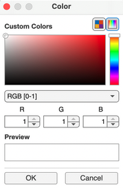

# User guide

ECODATA-Animate is a MATLAB® program for creating customized animated maps of animal movements. The program creates image frames that can be animated using the [ECODATA-Prepare Movie Maker App](https://ecodata-apps.readthedocs.io/en/latest/user_guide/movie_maker.html). [Read our overview](https://www.movebank.org/cms/movebank-content/ecodata#how_to_use_ecodata) of how to use Movebank, MoveApps, ECODATA-Animate and ECODATA-Prepare to discover and process tracking data, remote sensing data, shapefiles and other layers to create custom visualizations and input for ecological analysis. To try the software before working with your own data, see [our example](https://www.movebank.org/cms/movebank-content/ecodata#example_ecodata_animation) based on publicly-available data sources.

```{Tip}
This user guide can also be downloaded for offline use! [Click here](https://readthedocs.org/projects/ecodata-animate/downloads/) to download the documentation in PDF, Epub, or zipped HTML format.
```

## Preparing input files
Inputs to ECODATA-Animate include the following:

- A file of movement track data in [Movebank](https://www.movebank.org/cms/movebank-content/get-started) format (required) that can include additional columns.
- Up to three dynamic raster files (maps) in NetCDF-4 format (optional). These can be used as background layers for the animation, with the possibility to display a colormap layer, a contour line layer, and a vector field layer. Use the [ECODATA-Prepare Tracks Explorer](https://ecodata-apps.readthedocs.io/en/latest/user_guide/tracks_explorer.html) and [read our suggestions](https://ecodata-apps.readthedocs.io/en/latest/environmental_data.html) to discover open remote sensing and weather data to use.
- Shapefiles with points, lines, or polygons containing other vector data you want to display (optional). For example, you could use this to include water bodies, roads or property lines. Use the [ECODATA-Prepare Subsetter App](https://ecodata-apps.readthedocs.io/en/latest/user_guide/subsetter.html) to crop large shapefiles for faster processing.
- A list of points to label on the map (optional) in a [structured .csv format](https://ecodata-animate.readthedocs.io/en/latest/user_guide/user_guide.html#labeled-points), with the option to restrict the display of the label to a range of dates.
- In addition, you can display elevation contours using a stored digital elevation model (DEM). This does not require a user file.

(general-notes)=
## General notes
- Expect some trial and error as you define settings and see how they appear in the saved frames.
- To review results with minimal processing time, you can start by generating just the last frame of the animation (select ``Generate last frame only`` under ``Output``. Or, you can limit the "time range" under "Animal track data", so that fewer frames are created. Once the settings are as desired, extend the time range to that of the full dataset for final processing.
- When clicking a button to select a filepath, the browser window might not automatically appear, and may be hidden behind other application windows or displayed on another monitor. Minimizing other windows or clicking on the application icon from the Dock may help to find it.

- After selecting a file or setting the output filepath, expect that it may take several seconds before the information loads or updates appear in the status window.
- Note that if you select an output directory that already has output files in it, these will be overwritten when you create a new animation.
- For help or to share suggestions, [submit a GitHub issue](https://github.com/jemissik/movebank_vis/issues) or contact support@movebank.org.

(custom-colors)=
### Using custom colors
It is possible to use custom colors for many of the animation layers. You can choose from the default colors in the dropdown boxes, or enter a custom color using a hexadecimal color value (e.g., ``#97d2f0``), which you can choose using a color picker like [this one](https://htmlcolorcodes.com/color-picker/) or [this one](https://davidmathlogic.com/colorblind) for developing effective palletes, or by identifying the color value in other files using graphics or mapping software. Throughout the application, where available, color pickers look like this, and also let you enter RGB or HSV color codes:
    

### Saving and reloading settings
- When an animation is created, the animation settings are saved to the output directory in a file called
``settings.mat``.
- Settings files can be reloaded into the app. To reload settings from a previous animation, click the
``Load settings`` button at the top of the app, and select a ``settings.mat`` file. You can then adjust the settings
for a new animation.

## Installation

1. [Download the installers for the latest release here](https://github.com/jemissik/movebank_vis/releases/latest), available for Mac and Windows. You can also see all releases (including pre-release versions) [here](https://github.com/jemissik/movebank_vis/releases).

    ```{Tip}
    The installer files for download are under the **Assets** section for a release. If you are on the main releases page, you may need to expand this section in order to see the files available for download.

    
    ```

1. A zipped folder will be downloaded to your computer. This folder contains:
    - The application installer (``ECODATA_Animate_Installer``): which installs MATLAB Runtime
    - The application (``ECODATA_Animate``)

1. Extract the files from the zipped folder (you may also move them to a different folder on your computer).
1. If this is the first time you have installed the app, open the ``ECODATA_Animate_Installer`` application to run the installer, and follow the on-screen prompts. If you have installed a previous version of the app (and therefore have MATLAB runtime installed already), you should be able to simply run the ``ECODATA_Animate`` file without needing to run the installer again.

    ```{Important}
    You may need to grant an exception to your security settings in order to run the installer. See [How to open a Mac app from an unidentified developer](https://support.apple.com/guide/mac-help/open-a-mac-app-from-an-unidentified-developer-mh40616/mac)

    Other potential issues:
    - If you receive the message "Your installation may require additional configuration steps" at the end of the installation process, this should be able to safely be ignored, see [this issue](https://github.com/jemissik/movebank_vis/issues/72) for more details.
    - If you receive the error message "Unable to write to the selected folder" when runing the installer, see [this issue](https://github.com/jemissik/movebank_vis/issues/73).
    ```

1. Once the application has been successfully installed, you can open the ``ECODATA_Animate`` application.
```{Note}
There will be a delay (10+ seconds) after launching the ``ECODATA-Animate`` application before the program opens.

A log file will also be generated in the installer folder (useful in case you need to report any issues).
```

### Updating to a new version of the app

- When updating to a new version of the app, you should be able to simply download the new version and run the new ``ECODATA_Animate`` application, without needing to run the installer again.
- You should be able to have multiple versions of the app installed at once, which may be useful if you want to try out features of a new release without deleting your working version of the app. Note that you can move/rename the ``ECODATA_Animate`` file (e.g., to add a version number to the file name).

## Animation instructions

```{toctree}
---
maxdepth: 3
---
user_guide