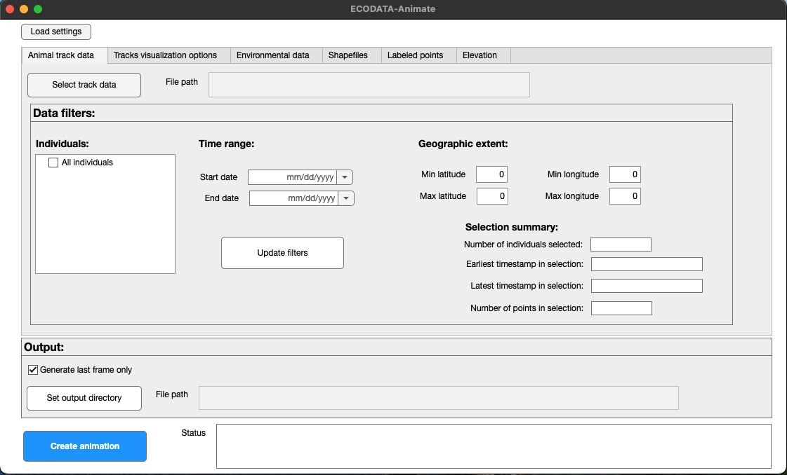
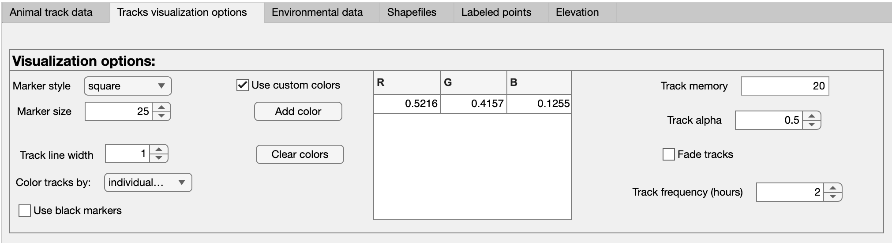
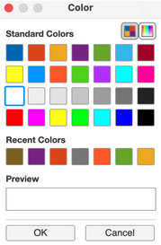
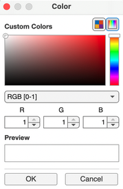
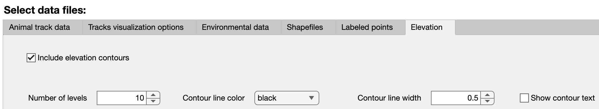

# Inputs and settings

After opening the program, you will see a main window with six tabs, each containing settings for different input data. Settings and instructions for each tab are provided below.



(animal-track-data)=
## Animal track data

Here you upload a file of animal tracking data to animate. This should follow the format used when [accessing data from Movebank](https://www.movebank.org/cms/movebank-content/access-data#download_data_in_movebank_format), following formats described in the [Movebank Attribute Dictionary](https://www.movebank.org/cms/movebank-content/movebank-attribute-dictionary). This file should contain at least the attributes [timestamp](http://vocab.nerc.ac.uk/collection/MVB/current/MVB000200/), [location-long](http://vocab.nerc.ac.uk/collection/MVB/current/MVB000146/) and [location-lat](http://vocab.nerc.ac.uk/collection/MVB/current/MVB000145/). It can be composed of tracking data subsets or combinations from multiple Movebank studies, as well as additional columns such as environmental covariates from [Env-DATA](https://www.movebank.org/cms/movebank-content/env-data) or [MoveApps](https://www.moveapps.org/), or reference data attributes.

1. Click on ``Select track data``. Browse to the .csv file containing your tracking data.
2. After the file is loaded, the filepath will be displayed, and the time range and geographic extent will be automatically populated based on the contents of the file.
3. Optionally, update the selected individuals, time range, or geographic extent as needed to refine what to include in the animation. Select ``Update filters`` to save your selections and calculate a summary of the contents of the filtered dataset.

(track-visualization-options)=
## Track visualization options



Here you define how the tracking data will be displayed in the animation, as well as the time period represented by each frame (in ``Track frequency``).

- Use the options on the left to define the design of the markers used to show the animals on the map. You can color the tracks by any attribute of the data (by default, the individual_local_identifier, or animal ID, is used).
- Use ``Track frequency`` to define the number of hours to represent in each frame of the animation. The track data are always resampled to this frequency for animation. For example, if it is set to 24 hours, the animation will generate one frame per day. Consider the sampling frequency in your tracking and environmental data, the length of time being animated, and how long you want the animation to be.
- Use ``Track memory`` to define the length of time to continue to show the movement trail, in terms of the track frequency. For example, if the track frequency is set to 24 (hours) and the track memory is set to 20, then a trail of the previous 20 days will be shown.
- Use ``Track opacity`` to define the transparency of the trail, with 0 being fully transparent and 1 being fully opaque.
- If the ``Fade tracks`` button is checked, the ``Track opacity`` setting is ignored and instead the trail will fade out with a "comet" effect.
- To choose your own track color/s, check the ``Use custom colors`` box and click on ``Add color``. You can select from a default palette or define colors using RGB, hexadecimal or HSV codes.

 

(environmental-data)=
## Environmental data

Here you can optionally select 1 or 2 static and/or dynamic raster files in NetCDF-4 format to use as background layers for the animation. One will be displayed as a colormap and the other with contour lines. You can request a variety of environmental raster data using NASA's [AppEEARS](https://ecodata-apps.readthedocs.io/en/latest/user_guide/tracks_explorer.html#requesting-environmental-data-from-nasa) service. While the program is designed to handle very large files, for more efficient processing and storage, use raster data only at the resolution needed for the animation. Files can be preprocessed to an appropriate resolution and masked using polygons with the ECODATA-Prepare [Gridded Data Explorer App](https://ecodata-apps.readthedocs.io/en/latest/user_guide/gridded_data_explorer.html).

1. Click on ``Select gridded data`` and browse to a NetCDF (.nc) file containing raster environmental data to use as a color map in the background of the animation.
2. The app will attempt to populate the variables that define the time, location coordinates, and the variable to display in the animation. Review the results and click the dropdown boxes to update if needed.
3. Choose a color map. Current options are green, blue, diverging, and [jet](https://www.mathworks.com/help/matlab/ref/jet.html). By default, "green" will display lower values in darker colors. Check ``Invert color map`` to reverse this scale (for example, to show higher NDVI or EVI values in darker green).
4. Click on ``Select contour data`` and browse to a .nc file containing raster environmental data to display data from a raster file as contour lines in the background of the animation.
5. The app will attempt to populate the variables that define the time, location coordinates, and the variable to display in the animation. Review the results and click the dropdown boxes to update if needed.
6. Choose a color and width for the contour lines, and check the box next to ``Show contour text`` to display labels.

(shapefiles)=
## Shapefiles

Here you can optionally select shapefiles to display in your animation frames. These layers will appear beneath the animal tracks and above the environmental (raster) data layers. Note that these layers will be drawn in the order that they are entered (i.e. the first layer in the list will be drawn first, so it will be on the bottom).

1. Click on an ``Select shapefile`` button and browse to a shapefile containing a vector data layer to display in the animation.
2. Available display properties will depend on the type of vector layer:
- Polygons: Select a color for polygon outlines (``Edge color``) and fill (``Face color``), and define the fill transparency (``Face opacity``, 1 = fully opaque).
- Lines: Select a line color and width.
- Points: Select a color, marker style, and marker size.
You can choose from the default colors in the dropdown box, or enter a custom color using a hexadecimal color value (e.g., “#97d2f0”), which you can choose using a color picker like [this one](https://htmlcolorcodes.com/color-picker/) or by identifying the color value in other files using graphics or mapping software.
3. Repeat steps 1 and 2 to add additional shapefile layers, if desired.
4. If you want to remove shapefiles you have entered, you can click ``Clear all shapefiles`` to remove all of them, or ``Clear last shapefile`` to clear just the last one that was entered.


(labeled-points)=
## Labeled points

Here you can optionally define arbitrary points and labels to display in the animation, for example to identify place names or times and locations of relevant events.

1. Prepare a .csv file containing labels and their placement on the map. This file can be prepared using a spreadsheet (e.g., Excel), **as long it is saved as a .csv file**.
Information to include is as follows (all coordinates in decimal deg):
    - ``longitude`` and ``latitude`` (required): coordinates for the location of interest, in decimal degrees, WGS84
    - ``label`` (required): the text to display
    - ``start_time`` and ``end_time`` (optional): can be used to restrict the display of the label to the specified range of dates, in format yyyy-mm-dd
    - ``label_longitude`` and ``label_latitude`` (optional): coordinates where the label text should be placed on the map (left edge of label if the point is to the left of the label, right edge if the point is to the right of the label). This option is used if the label placement needs adjustment.
    - ``horizontal_alignment`` (optional): "right" or "left", indicating the alignment of the point relative to the label (e.g., "left" means that the point will be aligned to the left of the label). Defaults to "left" if not otherwise specified.

    An example will look something like this (this example is displayed in table format for easier reading, but **note that the file must be saved in .csv format**):

    | longitude 	| latitude 	| label        	| start_time 	| end_time   	| label_longitude 	| label_latitude 	| horizontal_alignment 	|
    |-----------	|----------	|--------------	|------------	|------------	|-----------------	|----------------	|----------------------	|
    | -123      	| 56       	| Test point 1 	| 2015-07-20 	| 2015-07-30 	| -123.1          	| 56.1           	|                      	|
    | -121.5    	| 54.5     	| Test point 2 	|            	|            	|                 	|                	| right                	|

    In .csv format:
    ```
    longitude,latitude,label,start_time,end_time,label_longitude,label_latitude,horizontal_alignment
    -123,56,Test point 1,2015-07-20,2015-07-30,-123.1,56.1,
    -121.5,54.5,Test point 2,,,,,right
    ```

    Note that only the ``longitude``, ``latutude``, and ``label`` columns are required, and rows can also be left empty in the optional columns.


2. Click on ``Select file`` and browse to the .csv file with the label information.
3. Adjust the marker color and size as desired.

(elevation)=
## Elevation



Here you can optionally select to display elevation contours, based on the [ETOPO1 1-Arc-Minute Global Relief Model](https://doi.org/10.7289/V5C8276M).

1. Check ``Include elevation contours`` to draw these on the map.
2. If selected, review or update the number of levels and line design to use, and choose whether or not to display labels on the contour lines.
